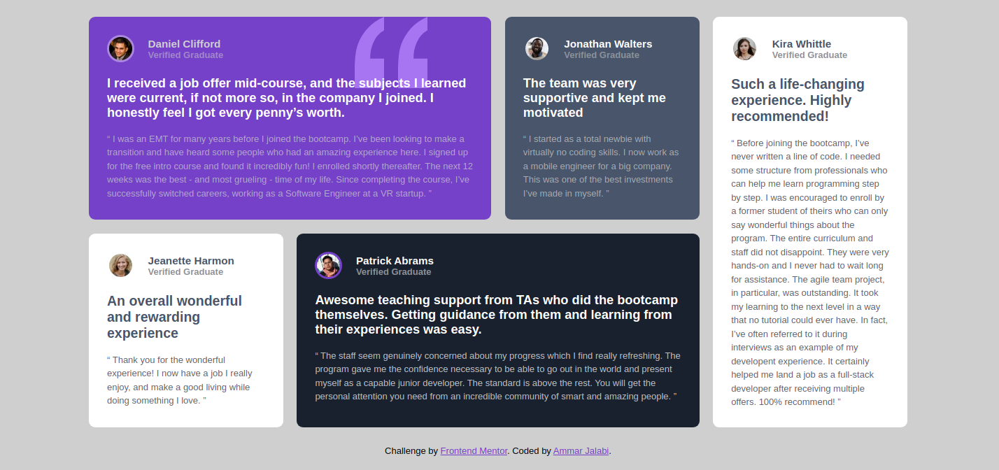

# Frontend Mentor - Testimonials grid section solution

This is a solution to the [Testimonials grid section challenge on Frontend Mentor](https://www.frontendmentor.io/challenges/testimonials-grid-section-Nnw6J7Un7). Frontend Mentor challenges help you improve your coding skills by building realistic projects. 

## Table of contents

- [Overview](#overview)
  - [The challenge](#the-challenge)
  - [Screenshot](#screenshot)
  - [Links](#links)
- [My process](#my-process)
  - [Built with](#built-with)
- [Author](#author)

**Note: Delete this note and update the table of contents based on what sections you keep.**

## Overview

### The challenge

Users should be able to:

- View the optimal layout for the site depending on their device's screen size

### Screenshot

### Links

- Solution URL: [Solution](https://github.com/AmmarCode/testimonials-grid-section)
- Live Site URL: [Live]( https://ammarcode.github.io/testimonials-grid-section/)

### Built with

- Semantic HTML5 markup
- CSS custom properties
- CSS Flex
- CSS Grid
- CSS Pseudo-element
- CSS Position
- CSS Z-index

### Useful resources

- [Example resource 1](https://www.example.com) - This helped me for XYZ reason. I really liked this pattern and will use it going forward.
- [Example resource 2](https://www.example.com) - This is an amazing article which helped me finally understand XYZ. I'd recommend it to anyone still learning this concept.

**Note: Delete this note and replace the list above with resources that helped you during the challenge. These could come in handy for anyone viewing your solution or for yourself when you look back on this project in the future.**

## Author

- Website - [Ammar Jalabi](https://ammarcode.github.io/Portfolio/)
- Frontend Mentor - [@yourusername](https://www.frontendmentor.io/profile/AmmarCode)
- Linkedin - [Ammar Jalabi](https://www.linkedin.com/in/ammar-jalabi-685a78114/)
